# Internal Developer Guide

> A hands-on, step-by-step guide for anyone working with this project — deploying contracts, managing accounts, assigning roles, transferring ownership, and debugging common issues.

---

## Table of Contents

1. [Prerequisites](#1-prerequisites)
2. [Project Structure Overview](#2-project-structure-overview)
3. [Working with Ganache (Local Blockchain)](#3-working-with-ganache-local-blockchain)
4. [Deploying the Smart Contract](#4-deploying-the-smart-contract)
5. [Managing MetaMask Accounts](#5-managing-metamask-accounts)
6. [Assigning Roles (Admin)](#6-assigning-roles-admin)
7. [Registering a Vehicle](#7-registering-a-vehicle)
8. [Adding Records to a Vehicle](#8-adding-records-to-a-vehicle)
9. [Transferring Vehicle Ownership](#9-transferring-vehicle-ownership)
10. [Viewing Vehicle History](#10-viewing-vehicle-history)
11. [Changing the Contract Admin](#11-changing-the-contract-admin)
12. [Modifying the Smart Contract](#12-modifying-the-smart-contract)
13. [Backend Development](#13-backend-development)
14. [Frontend Development](#14-frontend-development)
15. [Common Issues & Fixes](#15-common-issues--fixes)
16. [Environment Variables Reference](#16-environment-variables-reference)

---

## 1. Prerequisites

| Tool | Version | Purpose |
|------|---------|---------|
| Node.js | v18+ | Runtime for all components |
| npm | v9+ | Package manager |
| MetaMask | Latest | Browser wallet extension |
| Chrome/Firefox/Edge | Latest | Browser with MetaMask support |

Install MetaMask from [https://metamask.io/download/](https://metamask.io/download/).

---

## 2. Project Structure Overview

```mermaid
graph TB
    subgraph Root["📁 Root"]
        Contract["📄 contracts/VehicleRegistry.sol"]
        DeployScript["📜 scripts/deploy.js"]
        HardhatConfig["⚙️ hardhat.config.js"]
        Env["🔒 .env"]
    end

    subgraph Backend["🖥️ Backend (Express + MongoDB)"]
        Server["server.js — Entry point"]
        ConfigEnv["config/env.js — Loads .env"]
        ConfigContract["config/contract.js — Blockchain connection"]
        ConfigDB["config/db.js — MongoDB connection"]
        ABI["config/abi.json — Contract ABI"]
        Models["models/ — Mongoose schemas"]
        Controllers["controllers/ — Route handlers"]
        Routes["routes/ — API routes"]
        EventListener["listeners/eventListener.js — Chain → MongoDB sync"]
        ErrorHandler["middleware/errorHandler.js"]
    end

    subgraph Frontend["🌐 Frontend (React + Vite)"]
        ViteConfig["vite.config.js — Proxy /api → backend"]
        App["App.jsx — Routing + wallet hook"]
        UseWallet["hooks/useWallet.js — MetaMask connection"]
        ContractConfig["contract/config.js — Contract address"]
        ContractABI["contract/abi.json — Contract ABI"]
        APIClient["api/client.js — Backend API calls"]
        Components["components/ — Reusable UI"]
        Pages["pages/ — 5 pages"]
    end

    Root --> Backend
    Root --> Frontend
    DeployScript --> |"copies ABI"| ABI
    DeployScript --> |"copies ABI"| ContractABI
    DeployScript --> |"updates address"| ContractConfig
    ConfigContract --> |"reads"| Env
    UseWallet --> ContractConfig
    UseWallet --> ContractABI
    APIClient -.-> |"proxied via Vite"| Server

    style Root fill:#1a1a2e,stroke:#e94560,color:#fff
    style Backend fill:#16213e,stroke:#0f3460,color:#fff
    style Frontend fill:#1a1a2e,stroke:#e94560,color:#fff
```

---

## 3. Working with Ganache (Local Blockchain)

### What is Ganache?

Ganache is a local Ethereum blockchain simulator. Every account starts with **100 ETH**. It runs on `http://127.0.0.1:7545` with Chain ID `1337`.

### Starting Ganache

```bash
npx ganache --port 7545 --chain.chainId 1337 --wallet.deterministic
```

The `--wallet.deterministic` flag generates **10 accounts with fixed private keys** every time. This means:

- The same private key always produces the same address
- Account #0 is the deployer/admin
- Accounts #1-#9 are available for testing other roles

### The 10 Deterministic Accounts

| Account | Address | Role in Demo |
|---------|---------|-------------|
| #0 | `0x90F8bf6A479f320ead074411a4B0e7944Ea8c9C1` | **Admin/Deployer** (100 ETH) |
| #1 | `0xFFcf8FDEE72ac11b5c542428B35EEF5769C409f0` | Service Center |
| #2 | `0x22d491Bde2303f2f43325b2108D26f1eAbA1e32b` | Insurance |
| #3 | `0xE119591244C3BB07Aa24E15aD6945C70c6b0d70F` | Government |
| #4 | `0xd03ea8624C8c71657F4EE438cfDbFB9770893F43` | Buyer |
| #5-#9 | (other addresses) | Additional testing |

### Viewing Accounts in Ganache

Open the Ganache GUI or check the terminal output when it starts. Each account shows:
- **Balance:** 100 ETH
- **Transaction count:** 0 (increases with each transaction)
- **Private key:** Click the key icon 🔑 to reveal

### Stopping & Restarting Ganache

⚠️ **WARNING:** Restarting Ganache **destroys ALL data**:
- All deployed contracts are gone
- All registered vehicles are gone
- All records are gone
- You must redeploy and re-register everything

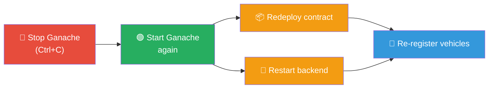

---

## 4. Deploying the Smart Contract

### First-Time Deployment

```bash
# Step 1: Make sure Ganache is running
npx ganache --port 7545 --chain.chainId 1337 --wallet.deterministic

# Step 2: Compile the contract
npx hardhat compile

# Step 3: Deploy to Ganache
npx hardhat run scripts/deploy.js --network ganache
```

### What the Deploy Script Does

The `scripts/deploy.js` script performs **4 actions**:

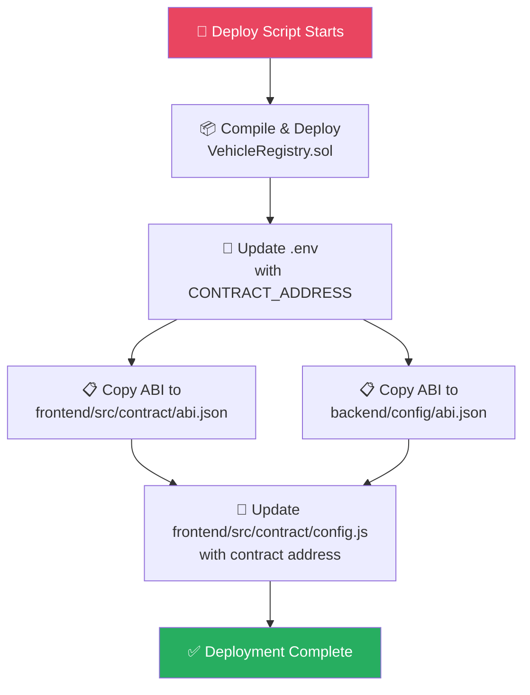

### After Deployment

```
VehicleRegistry deployed to: 0xCfEB869F69431e42cdB54A4F4f105C19C080A601
Updated .env with CONTRACT_ADDRESS
Copied ABI to frontend
Copied ABI to backend
Updated frontend config
```

### Redeployment (When Needed)

You need to redeploy when:
- Ganache was restarted
- You modified the smart contract
- You want a fresh state

```bash
npx hardhat run scripts/deploy.js --network ganache
```

Then restart the backend to pick up the new contract address.

---

## 5. Managing MetaMask Accounts

### Adding Ganache Network to MetaMask

1. Open MetaMask → click network dropdown → **"Add network"** → **"Add a network manually"**

| Field | Value |
|-------|-------|
| Network Name | `Ganache` |
| RPC URL | `http://127.0.0.1:7545` |
| Chain ID | `1337` |
| Currency Symbol | `ETH` |

2. Click **Save**

### Import an Account (Private Key)

1. Switch MetaMask to the **Ganache** network
2. Click account icon (top right) → **"Import account"**
3. Select **"Private Key"**
4. Paste the private key from Ganache (click the 🔑 icon next to an account)
5. Click **Import**

### Switching Between Accounts

To simulate different users (owner, service center, insurance, etc.):

1. Import multiple Ganache accounts into MetaMask (using their private keys)
2. Click the account icon → select the account you want to use
3. Make sure you're on the Ganache network

### Important Notes

- **Account #0** is the only account that can assign roles (it's the admin)
- Each account has **100 ETH** on Ganache
- You can create more accounts in Ganache, but deterministic mode only gives you 10 with fixed keys
- Every transaction costs a small amount of ETH (gas fee ~0.0001 ETH on Ganache)

---

## 6. Assigning Roles (Admin)

### Prerequisites
- Connected as **Account #0** (the admin/deployer)
- Contract is deployed and backend is running
- You have the address of the account you want to assign a role to

### Step-by-Step

1. Open the app at `http://localhost:5173`
2. Connect MetaMask with **Account #0** (the deployer)
3. Navigate to **Admin** page (you should see the role assignment form)
4. Enter the **wallet address** of the target account
5. Select the **role** from the dropdown:
   - `OWNER` — Can register vehicles, transfer ownership
   - `SERVICE_CENTER` — Can add service records
   - `INSURANCE` — Can add insurance records
   - `GOVERNMENT` — Can add inspection records
   - `BUYER` — Can view vehicle history
   - `NONE` — No special permissions
6. Click **"Assign Role"**
7. **Confirm** the transaction in MetaMask
8. Wait for confirmation

### Verifying the Role Assignment

Switch MetaMask to the target account and check the **role badge** in the navbar. It should show the assigned role.

### How It Works Internally

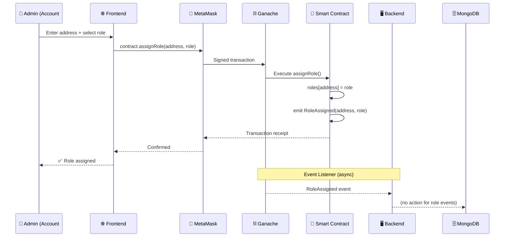

---

## 7. Registering a Vehicle

### Prerequisites
- Connected with **any account** (the account becomes the owner)
- Contract is deployed

### Step-by-Step

1. Connect MetaMask with the account that will own the vehicle
2. Navigate to **Register** page
3. Fill in the form:
   - **VIN:** Vehicle Identification Number (e.g., `VIN1001`)
   - **Make:** Manufacturer (e.g., `Toyota`)
   - **Model:** Model name (e.g., `Camry`)
   - **Year:** Manufacturing year (e.g., `2023`)
4. Click **"Register Vehicle"**
5. **Confirm** the transaction in MetaMask
6. Wait for blockchain confirmation
7. You'll be redirected to the vehicle's history page

### What Happens on the Blockchain

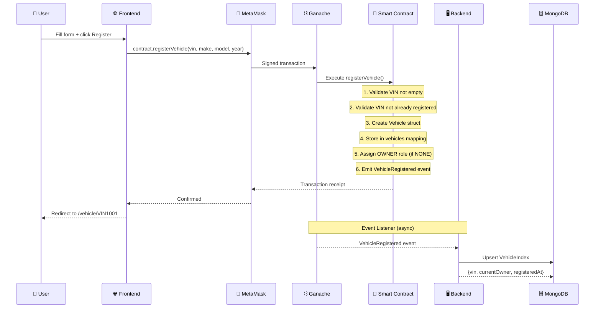

### Important Rules

- **VIN must be unique** — you cannot register the same VIN twice
- **VIN cannot be empty**
- The registering account becomes the **initial owner**
- If the account had `NONE` role, it's automatically upgraded to `OWNER`

---

## 8. Adding Records to a Vehicle

### Prerequisites
- Connected with an account that has **SERVICE_CENTER**, **INSURANCE**, or **GOVERNMENT** role
- The target vehicle must already be registered on the blockchain

### Step-by-Step

1. Assign a role to your test account first (using Account #0 → Admin page)
2. Switch MetaMask to the role-assigned account
3. Navigate to **Add Record** page
4. Fill in the form:
   - **VIN:** The vehicle's VIN (e.g., `VIN1001`)
   - **Record Type:** Select one:
     - `SERVICE` — Oil change, brake repair, tire rotation, etc.
     - `ACCIDENT` — Accident report
     - `INSURANCE` — Insurance claim or policy update
     - `INSPECTION` — Government safety/emissions inspection
   - **Description:** What happened (e.g., "Regular 5000km oil change")
   - **Data Hash (optional):** A hash of supporting documents
5. Click **"Add Record"**
6. **Confirm** in MetaMask
7. Wait for confirmation

### Who Can Add What?

| Role | Can Add Record Types |
|------|---------------------|
| SERVICE_CENTER | SERVICE |
| INSURANCE | INSURANCE |
| GOVERNMENT | INSPECTION, any type |
| OWNER | Cannot add records (only registers and transfers) |
| BUYER/NONE | Cannot add records |

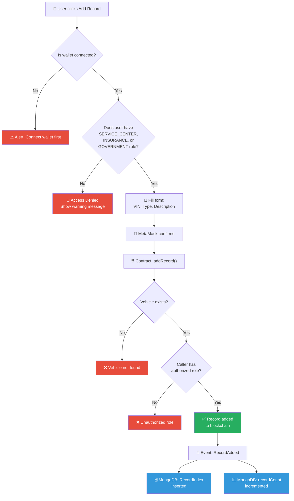

---

## 9. Transferring Vehicle Ownership

### Prerequisites
- Connected with the **current owner** account of the vehicle
- The vehicle must be registered

### Step-by-Step

1. Connect MetaMask with the **current owner** account
2. Navigate to **Transfer** page
3. Enter the **VIN** of the vehicle
4. Click **"Check"** to verify ownership
   - If you're the owner → ✅ "You are the current owner"
   - If not → ⚠️ "You are not the current owner"
5. Enter the **new owner's wallet address**
6. Click **"Transfer Ownership"**
7. **Confirm** in MetaMask
8. Wait for confirmation

### What Happens on the Blockchain

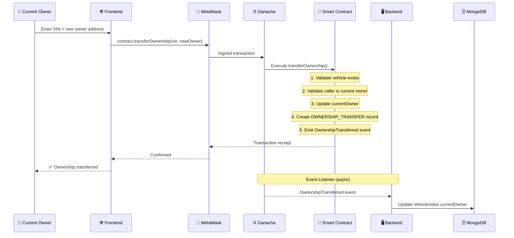

### Important Notes

- Only the **current owner** can transfer
- After transfer, the previous owner can no longer manage the vehicle
- An automatic record is added to the vehicle's history
- The new owner gets full control (can register more vehicles, transfer again, etc.)
- The new owner does NOT automatically get the OWNER role unless they have NONE

---

## 10. Viewing Vehicle History

### Without Wallet (Public Access)

Anyone can look up a vehicle's history:

1. Go to the **History** page (home page)
2. Enter a VIN
3. Click **"Look Up"**
4. View the complete vehicle history

No MetaMask connection required. This is a core feature — **blockchain data is publicly verifiable**.

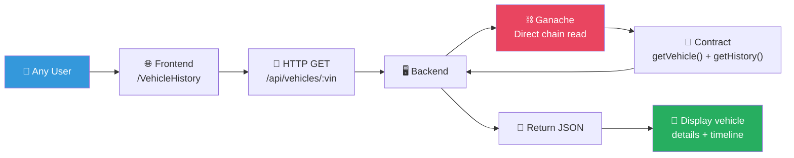

### What You'll See

- **Vehicle Details:** VIN, Make, Model, Year, Current Owner
- **Record Count:** Total number of records
- **History Timeline:** All records in chronological order
  - Vehicle registration
  - Service/insurance/inspection records
  - Ownership transfers

---

## 11. Changing the Contract Admin

### The Problem

The contract does **NOT** have a function to change the admin. The admin is set in the constructor:

```solidity
constructor() {
    admin = msg.sender;
    roles[msg.sender] = Role.GOVERNMENT;
}
```

### If You Need to Change Admin

You have two options:

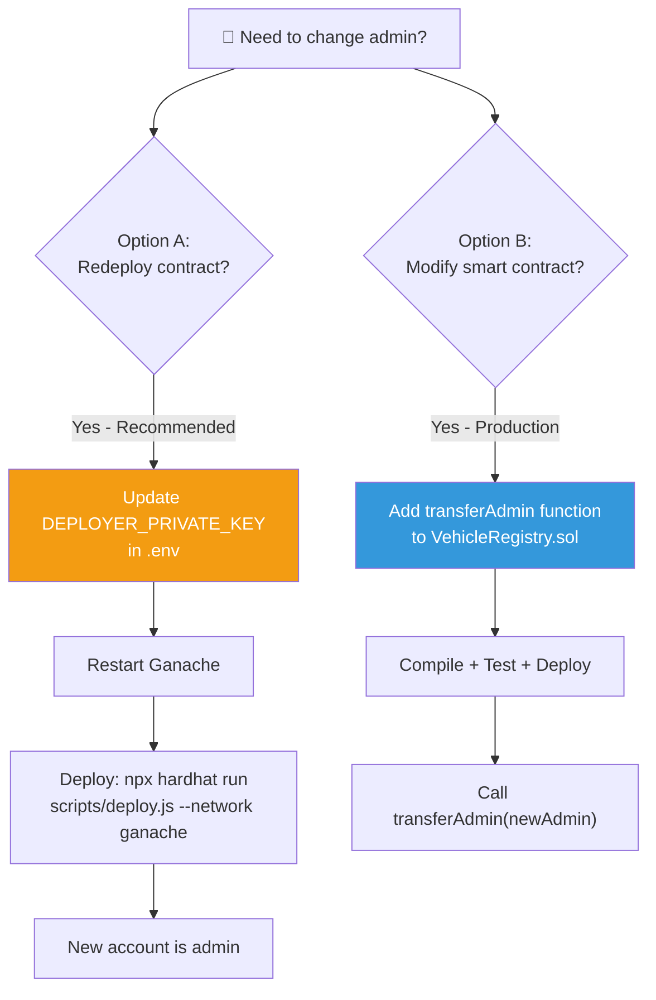

**Option A: Redeploy the Contract (Recommended for Development)**

1. Update `DEPLOYER_PRIVATE_KEY` in `.env` to the new account's private key
2. Restart Ganache (or create a new chain)
3. Deploy: `npx hardhat run scripts/deploy.js --network ganache`
4. The new account becomes the admin

**Option B: Modify the Smart Contract (For Production)**

Add a `transferAdmin` function to `VehicleRegistry.sol`:

```solidity
function transferAdmin(address _newAdmin) external onlyAdmin {
    require(_newAdmin != address(0), "Invalid address");
    admin = _newAdmin;
}
```

Then redeploy.

---

## 12. Modifying the Smart Contract

### Contract File Location

```
contracts/VehicleRegistry.sol
```

### Making Changes

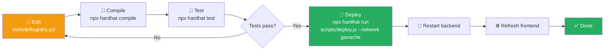

### Adding a New Function

Example: Add a function to get all vehicles by owner:

```solidity
function getVehiclesByOwner(address _owner) external view returns (string[] memory) {
    // Implementation here
}
```

After adding:
1. The ABI is automatically updated by the deploy script
2. Add the function call in `backend/controllers/vehicleController.js` if needed
3. Add UI in `frontend/src/pages/` if needed

### Common Contract Modifications

| Change | Files to Update |
|--------|----------------|
| Add new function | `VehicleRegistry.sol`, deploy, restart backend |
| Change role permissions | `VehicleRegistry.sol`, `AddRecord.jsx` (AUTHORIZED_ROLES) |
| Add new record type | `VehicleRegistry.sol`, deploy, update RECORD_TYPES in backend + frontend |
| Add new vehicle field | `VehicleRegistry.sol`, `VehicleIndex.js`, `RegisterVehicle.jsx` |

---

## 13. Backend Development

### Starting the Backend

```bash
cd backend
npm install
node server.js
```

The backend runs on **port 4000**.

### Key Files

| File | Purpose |
|------|---------|
| `server.js` | Express app setup, middleware, routes |
| `config/contract.js` | Connects to Ganache via ethers.js |
| `config/db.js` | Connects to MongoDB Atlas |
| `config/env.js` | Loads `.env` from root directory |
| `listeners/eventListener.js` | Subscribes to blockchain events, syncs to MongoDB |
| `controllers/vehicleController.js` | Handles vehicle API requests |
| `controllers/recordController.js` | Handles record API requests |

### How the Backend Connects to Blockchain

```javascript
// config/contract.js
const provider = new ethers.JsonRpcProvider(RPC_URL);
const contract = new ethers.Contract(CONTRACT_ADDRESS, abi, provider);
```

The backend uses a **read-only provider** (no private key needed). It reads data from the blockchain but never writes. All writes happen through MetaMask on the frontend.

### How the Event Listener Works

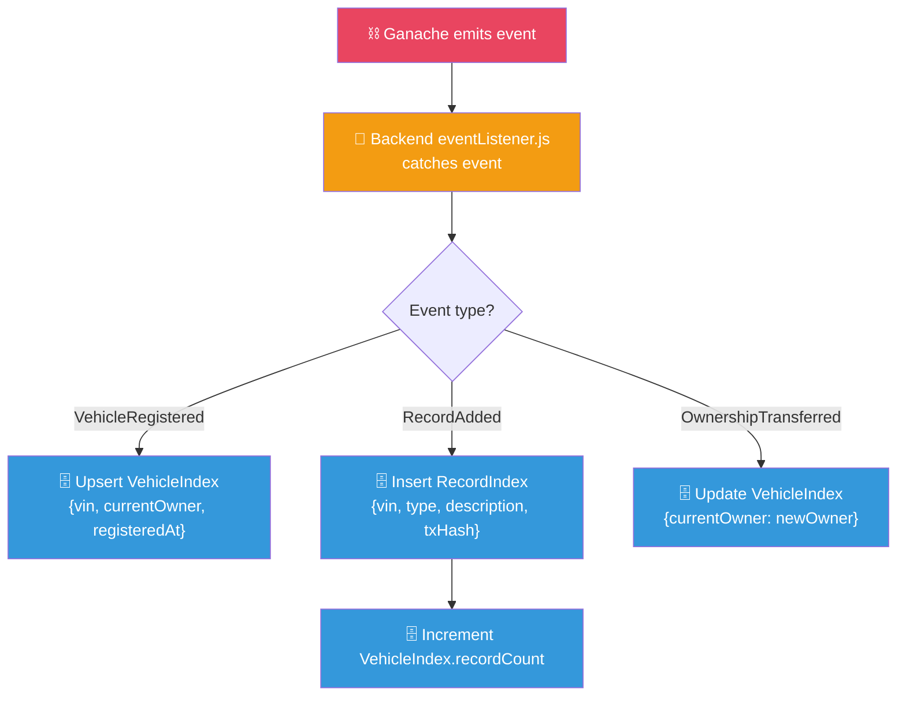

```javascript
// listeners/eventListener.js
contract.on("VehicleRegistered", async (vin, owner, timestamp) => {
    await VehicleIndex.findOneAndUpdate({ vin }, { ... }, { upsert: true });
});
```

The event listener:
1. Subscribes to blockchain events (VehicleRegistered, RecordAdded, OwnershipTransferred)
2. When an event fires, it writes/updates MongoDB
3. This keeps MongoDB in sync with the blockchain for fast queries

### API Routes

| Method | Route | Purpose |
|--------|-------|---------|
| GET | `/api/vehicles/:vin` | Full vehicle detail (reads from chain) |
| GET | `/api/vehicles` | List/search vehicles (reads from MongoDB) |
| GET | `/api/vehicles/:vin/records` | Records for a VIN (reads from MongoDB) |
| GET | `/api/records/recent` | Recent records (reads from MongoDB) |
| GET | `/api/health` | Health check (chain + DB status) |

### Adding a New API Endpoint

1. Create handler in `controllers/`
2. Add route in `routes/`
3. Add frontend API client function in `frontend/src/api/client.js`
4. Use in a page component

---

## 14. Frontend Development

### Starting the Frontend

```bash
cd frontend
npm install
npm run dev
```

The frontend runs on **port 5173**.

### Key Concepts

#### useWallet Hook (`hooks/useWallet.js`)

This is the core hook that manages wallet state:

```javascript
const { account, role, roleName, connect, provider, signer, contract, wrongNetwork } = useWallet();
```

| Return Value | Description |
|-------------|-------------|
| `account` | Connected wallet address (or null) |
| `role` | Numeric role (0-5) |
| `roleName` | Role name string ("OWNER", "SERVICE_CENTER", etc.) |
| `connect` | Function to connect MetaMask |
| `provider` | ethers.js BrowserProvider |
| `signer` | ethers.js Signer (for signing transactions) |
| `contract` | ethers.js Contract instance (connected to signer) |
| `wrongNetwork` | Boolean: is the user on wrong network? |

### Wallet Connection Flow

```mermaid
flowchart TD
    A["👤 User clicks\nConnect MetaMask"] --> B{"window.ethereum\nexists?"}
    B -->|No| C["⚠️ Alert: Please\ninstall MetaMask"]
    B -->|Yes| D["🔗 Create\nBrowserProvider"]
    D --> E["📡 Request accounts\neth_requestAccounts"]
    E --> F["🌐 Check chain ID\n=== 1337?"}
    F -->|No| G["🔄 Try wallet_switch\nEthereumChain"]
    G -->|Success| H["✅ Continue"]
    G -->|Fail| I["🚫 Show Wrong\nNetwork button"]
    F -->|Yes| H
    H --> J["🔑 Get signer\n+ address"]
    J --> K["📜 Create Contract\ninstance with signer"]
    K --> L["🎭 Fetch role\ngetMyRole()"]
    L --> M["📦 Update React state\nUI updates"]

    style C fill:#e74c3c,color:#fff
    style I fill:#e74c3c,color:#fff
    style M fill:#27ae60,color:#fff
```

#### How the Contract is Used

```javascript
// In a page component:
const tx = await contract.registerVehicle(vin, make, model, year);
const receipt = await tx.wait(); // Wait for blockchain confirmation
```

The `contract` object is an ethers.js Contract instance connected to the user's MetaMask signer. Every call is a blockchain transaction that the user must approve in MetaMask.

### Adding a New Page

1. Create `frontend/src/pages/NewPage.jsx`
2. Add route in `App.jsx`:
   ```jsx
   <Route path="/new-page" element={<NewPage contract={wallet.contract} account={wallet.account} />} />
   ```
3. Add nav link in the `Navbar` component in `App.jsx`

### Proxy Configuration

The Vite dev server proxies `/api` requests to the backend:

```javascript
// vite.config.js
server: {
    proxy: {
        "/api": {
            target: "http://localhost:4000",
            changeOrigin: true,
        },
    },
},
```

This means `fetch("/api/vehicles/VIN1001")` in the frontend is forwarded to `http://localhost:4000/api/vehicles/VIN1001`.

---

## 15. Common Issues & Fixes

### "Please install MetaMask to use this application"

**Cause:** MetaMask browser extension is not installed.
**Fix:** Install MetaMask from [metamask.io](https://metamask.io/download/).

### "Wrong Network — Switch to Chain 1337"

**Cause:** MetaMask is connected to a different network.
**Fix:** Add the Ganache network to MetaMask (RPC: `http://127.0.0.1:7545`, Chain ID: `1337`).

### Transaction Fails / "Insufficient Funds"

**Cause:** Your MetaMask account has 0 ETH.
**Fix:** Import the correct Ganache account using its private key (each Ganache account has 100 ETH).

### "could not decode result data (value="0x")"

**Cause:** The contract address is wrong or Ganache was restarted (contract no longer exists at that address).

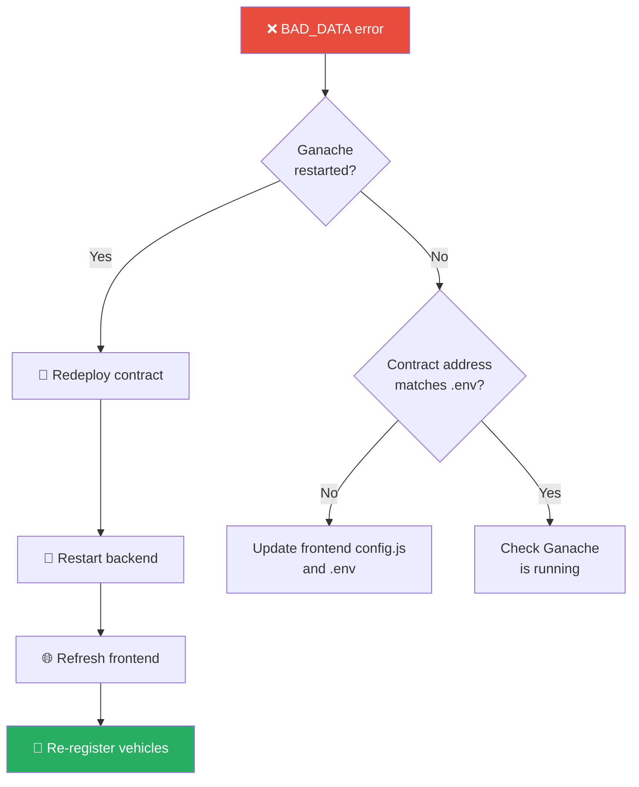

### Backend Fails to Start

**Cause:** `CONTRACT_ADDRESS` not set or MongoDB connection failed.
**Fix:**
1. Deploy the contract first (this sets `CONTRACT_ADDRESS` in `.env`)
2. Check MongoDB connection string in `.env`
3. Ensure Ganache is running

### "Vehicle not found" When Registering

**Cause:** VIN is already registered.
**Fix:** Use a different VIN or check Ganache for existing vehicles.

### Frontend Shows Blank / Errors

**Cause:** Frontend not running or Vite proxy misconfigured.
**Fix:**
1. Restart frontend: `cd frontend && npm run dev`
2. Check that backend is running on port 4000
3. Check browser console for errors

---

## 16. Environment Variables Reference

All environment variables are in the root `.env` file:

| Variable | Description | Example |
|----------|-------------|---------|
| `RPC_URL` | Ganache RPC endpoint | `http://127.0.0.1:7545` |
| `CHAIN_ID` | Ganache chain ID | `1337` |
| `CONTRACT_ADDRESS` | Deployed contract address | Auto-set by deploy script |
| `DEPLOYER_PRIVATE_KEY` | Private key for the admin account | `0x4f3edf...` |
| `PORT` | Backend server port | `4000` |
| `MONGODB_URI` | MongoDB connection string | `mongodb+srv://...` |
| `MONGODB_DB_NAME` | MongoDB database name | `vehicle_registry` |

### How `.env` is Loaded

- **Root:** `hardhat.config.js` uses `require("dotenv").config()`
- **Backend:** `backend/config/env.js` loads from `../../.env` (root)
- **Frontend:** Does NOT read `.env` directly — config is in `frontend/src/contract/config.js`
