# Blockchain-Enabled Vehicle Data Integrity System

## Professional System Documentation

---

## Table of Contents

1. [Executive Summary](#1-executive-summary)
2. [System Overview](#2-system-overview)
3. [System Architecture](#3-system-architecture)
4. [Technology Stack](#4-technology-stack)
5. [Blockchain Layer — How It Works](#5-blockchain-layer--how-it-works)
6. [Smart Contract Design](#6-smart-contract-design)
7. [Backend Architecture](#7-backend-architecture)
8. [Frontend Architecture](#8-frontend-architecture)
9. [Database Design](#9-database-design)
10. [Data Flow Diagrams](#10-data-flow-diagrams)
11. [Feature Specification](#11-feature-specification)
12. [Security Model](#12-security-model)
13. [API Reference](#13-api-reference)
14. [Event-Driven Architecture](#14-event-driven-architecture)
15. [Deployment Architecture](#15-deployment-architecture)
16. [Non-Functional Requirements](#16-non-functional-requirements)
17. [Future Enhancements](#17-future-enhancements)

---

## 1. Executive Summary

The **Blockchain-Enabled Vehicle Data Integrity System** is a decentralized application (dApp) that provides an immutable, transparent, and verifiable record of a vehicle's complete lifecycle — from registration through ownership transfers, service history, insurance claims, accident reports, and government inspections.

### Key Value Propositions

- **Immutability:** Once written to the blockchain, records cannot be altered or deleted
- **Transparency:** Any stakeholder can verify a vehicle's complete history
- **Decentralization:** No single authority controls the data
- **Trustlessness:** Parties don't need to trust each other — they trust the blockchain
- **Public Verification:** Anyone can look up a vehicle's history without even connecting a wallet

---

## 2. System Overview

### High-Level Description

The system operates across four layers:

1. **Blockchain Layer (Ethereum/Ganache):** The source of truth for all vehicle data, ownership, and records
2. **Backend Layer (Node.js/Express):** A read-optimized caching layer using MongoDB, synced via blockchain event listeners
3. **Frontend Layer (React/Vite):** A web interface that interacts with MetaMask for transaction signing and the backend for data queries
4. **Wallet Layer (MetaMask):** Browser extension that manages private keys and signs blockchain transactions

### Core Principles

| Principle | Implementation |
|-----------|---------------|
| Blockchain is source of truth | All writes go to the chain first; MongoDB is a cache |
| Writes are user-signed | Every transaction is signed by the user's MetaMask wallet |
| Public verification | Anyone can look up vehicle history without authentication |
| Event-driven sync | Blockchain events trigger MongoDB updates in real-time |

---

## 3. System Architecture

### Architecture Diagram

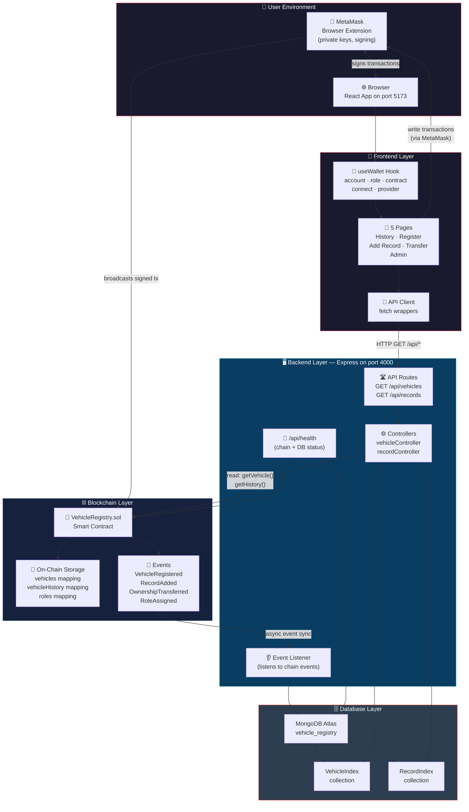
```mermaid
graph TB
    subgraph User["👤 User Environment"]
        MetaMask["🔐 MetaMask\nBrowser Extension\n(private keys, signing)"]
        Browser["🌐 Browser\nReact App on port 5173"]
    end

    subgraph Ganache["⛓️ Blockchain Layer"]
        Contract["📜 VehicleRegistry.sol\nSmart Contract"]
        Storage["💾 On-Chain Storage\nvehicles mapping\nvehicleHistory mapping\nroles mapping"]
        Events["📡 Events\nVehicleRegistered\nRecordAdded\nOwnershipTransferred\nRoleAssigned"]
    end

    subgraph Backend["🖥️ Backend Layer — Express on port 4000"]
        Routes["🛣️ API Routes\nGET /api/vehicles\nGET /api/records"]
        Controllers["⚙️ Controllers\nvehicleController\nrecordController"]
        EventListener["👂 Event Listener\n(listens to chain events)"]
        HealthCheck["💓 /api/health\n(chain + DB status)"]
    end

    subgraph Database["🗄️ Database Layer"]
        MongoDB["MongoDB Atlas\nvehicle_registry"]
        VehicleIndex["VehicleIndex\ncollection"]
        RecordIndex["RecordIndex\ncollection"]
    end

    subgraph Frontend["📱 Frontend Layer"]
        Pages["📄 5 Pages\nHistory · Register\nAdd Record · Transfer\nAdmin"]
        UseWallet["🎣 useWallet Hook\naccount · role · contract\nconnect · provider"]
        APIClient["📡 API Client\nfetch wrappers"]
    end

    MetaMask <-->|"signs transactions"| Browser
    Browser --> UseWallet
    UseWallet --> Pages
    Pages -->|"write transactions\n(via MetaMask)"| MetaMask
    MetaMask -->|"broadcasts signed tx"| Contract
    Contract --> Storage
    Contract --> Events
    Events -->|"async event sync"| EventListener
    EventListener --> MongoDB
    MongoDB --> VehicleIndex
    MongoDB --> RecordIndex
    Pages --> APIClient
    APIClient -->|"HTTP GET /api/*"| Routes
    Routes --> Controllers
    Controllers -->|"read: getVehicle()\ngetHistory()"| Contract
    Controllers --> VehicleIndex
    Controllers --> RecordIndex
    HealthCheck --> Contract
    HealthCheck --> MongoDB

    style User fill:#1a1a2e,stroke:#e94560,color:#fff
    style Ganache fill:#16213e,stroke:#0f3460,color:#fff
    style Backend fill:#0a3d62,stroke:#38ada9,color:#fff
    style Database fill:#2c3e50,stroke:#e74c3c,color:#fff
    style Frontend fill:#1a1a2e,stroke:#e94560,color:#fff
```

### Component Responsibilities

| Component | Technology | Role |
|-----------|-----------|------|
| **Smart Contract** | Solidity 0.8.24 | On-chain logic: vehicle registration, record management, role-based access |
| **Blockchain** | Ganache (port 7545) | Simulated Ethereum chain for development/testing |
| **Backend** | Node.js + Express | API server, blockchain event listener, MongoDB sync |
| **Database** | MongoDB Atlas | Read-optimized cache for fast queries |
| **Frontend** | React 18 + Vite | User interface, MetaMask integration |
| **Wallet** | MetaMask | Transaction signing, account management |

---

## 4. Technology Stack

### Frontend

| Technology | Version | Purpose |
|------------|---------|---------|
| React | 18.2 | UI library |
| React Router | 6.20 | Client-side routing |
| Vite | 5.0 | Build tool + dev server |
| ethers.js | 6.17 | Ethereum client library |

### Backend

| Technology | Version | Purpose |
|------------|---------|---------|
| Node.js | 18+ | Runtime |
| Express | 4.18 | HTTP framework |
| Mongoose | 8.5 | MongoDB ODM |
| ethers.js | 6.17 | Blockchain interaction |
| dotenv | 16.4 | Environment config |

### Blockchain

| Technology | Version | Purpose |
|------------|---------|---------|
| Solidity | 0.8.24 | Smart contract language |
| Hardhat | 2.22 | Development framework |
| Ganache | 7.9 | Local blockchain simulator |

### Database

| Technology | Purpose |
|------------|---------|
| MongoDB Atlas | Cloud-hosted NoSQL database |

---

## 5. Blockchain Layer — How It Works

### What Is a Blockchain?

A blockchain is a **distributed, immutable ledger**. Data is stored in **blocks**, and each block is cryptographically linked to the previous one, forming a **chain**. Once data is written to a block and the block is confirmed, it cannot be modified or deleted.

### How This Project Uses Blockchain

In this system, the blockchain serves as the **single source of truth** for:

1. **Vehicle registration data** (VIN, make, model, year, owner)
2. **Vehicle history records** (service, accident, insurance, inspection)
3. **Ownership transfers** (who currently owns each vehicle)
4. **Role assignments** (who can perform what actions)

### Ethereum Transaction Lifecycle

Every action in this system (register vehicle, add record, transfer ownership, assign role) follows this flow:

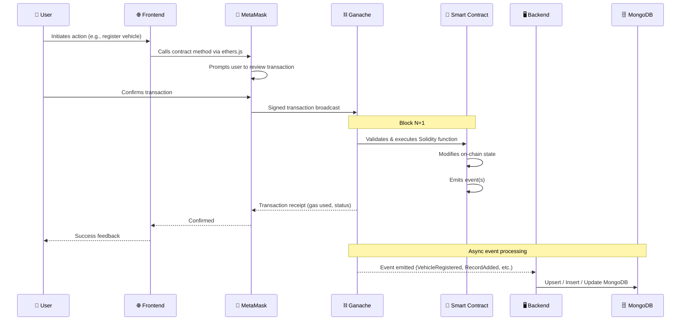
```mermaid
sequenceDiagram
    participant U as 👤 User
    participant F as 🌐 Frontend
    participant M as 🔐 MetaMask
    participant G as ⛓️ Ganache
    participant C as 📜 Smart Contract
    participant B as 🖥️ Backend
    participant DB as 🗄️ MongoDB

    U->>F: Initiates action (e.g., register vehicle)
    F->>M: Calls contract method via ethers.js
    M->>M: Prompts user to review transaction
    U->>M: Confirms transaction
    M->>G: Signed transaction broadcast

    Note over G,C: Block N+1
    G->>C: Validates & executes Solidity function
    C->>C: Modifies on-chain state
    C->>C: Emits event(s)

    G-->>M: Transaction receipt (gas used, status)
    M-->>F: Confirmed
    F-->>U: Success feedback

    Note over G,DB: Async event processing
    G-->>B: Event emitted (VehicleRegistered, RecordAdded, etc.)
    B->>DB: Upsert / Insert / Update MongoDB
```

### Gas and Fees

- **Gas** is the unit of computational effort on Ethereum
- Every transaction requires gas, paid in ETH
- On Ganache, each account starts with **100 ETH**
- Typical transaction cost: **< 0.0001 ETH** (negligible on a local chain)
- Gas limit is estimated automatically by MetaMask

### Smart Contract Interaction via ethers.js

The frontend and backend both use **ethers.js v6** to interact with the blockchain:

```javascript
// Frontend: Write operations (via MetaMask signer)
const contract = new ethers.Contract(address, abi, signer);
const tx = await contract.registerVehicle(vin, make, model, year);
await tx.wait(); // Wait for confirmation

// Backend: Read operations (via read-only provider)
const provider = new ethers.JsonRpcProvider("http://127.0.0.1:7545");
const contract = new ethers.Contract(address, abi, provider);
const vehicle = await contract.getVehicle(vin);
```

---

## 6. Smart Contract Design

### Contract: VehicleRegistry

**Location:** `contracts/VehicleRegistry.sol`

### Data Structures

```solidity
// Roles determine what actions an account can perform
enum Role { NONE, OWNER, SERVICE_CENTER, INSURANCE, GOVERNMENT, BUYER }

// Record types for vehicle history
enum RecordType { SERVICE, ACCIDENT, INSURANCE, OWNERSHIP_TRANSFER, INSPECTION }

// Vehicle stored on-chain
struct Vehicle {
    string vin;            // Vehicle Identification Number
    string make;           // Manufacturer (Toyota, Honda, etc.)
    string model;          // Model name (Camry, Civic, etc.)
    uint16 year;           // Manufacturing year
    address currentOwner;  // Current owner's wallet address
    bool exists;           // Whether this VIN is registered
}

// Record in vehicle's history
struct Record {
    RecordType recordType; // Type of record
    string dataHash;       // Optional hash of supporting documents
    string description;    // Human-readable description
    address recordedBy;    // Who recorded this
    uint256 timestamp;     // When it was recorded (block.timestamp)
}
```

### State Variables

```solidity
address public admin;                              // Contract admin (deployer)
mapping(string => Vehicle) private vehicles;       // VIN → Vehicle
mapping(string => Record[]) private vehicleHistory; // VIN → Records
mapping(address => Role) public roles;             // Address → Role
```

### Contract Class Diagram

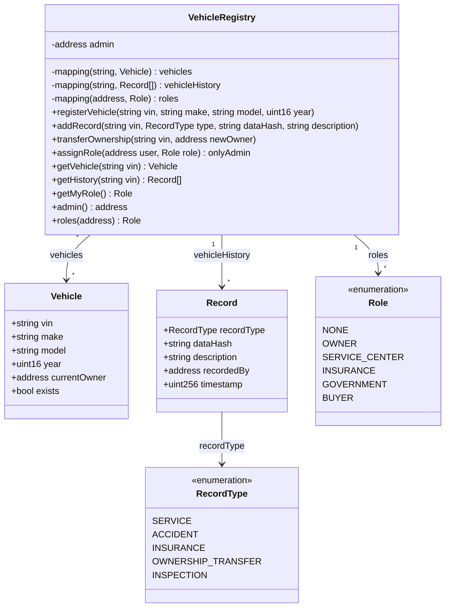
```mermaid
classDiagram
    class VehicleRegistry {
        -address admin
        -mapping(string, Vehicle) vehicles
        -mapping(string, Record[]) vehicleHistory
        -mapping(address, Role) roles
        +registerVehicle(string vin, string make, string model, uint16 year)
        +addRecord(string vin, RecordType type, string dataHash, string description)
        +transferOwnership(string vin, address newOwner)
        +assignRole(address user, Role role) onlyAdmin
        +getVehicle(string vin) Vehicle
        +getHistory(string vin) Record[]
        +getMyRole() Role
        +admin() address
        +roles(address) Role
    }

    class Vehicle {
        +string vin
        +string make
        +string model
        +uint16 year
        +address currentOwner
        +bool exists
    }

    class Record {
        +RecordType recordType
        +string dataHash
        +string description
        +address recordedBy
        +uint256 timestamp
    }

    class Role {
        <<enumeration>>
        NONE
        OWNER
        SERVICE_CENTER
        INSURANCE
        GOVERNMENT
        BUYER
    }

    class RecordType {
        <<enumeration>>
        SERVICE
        ACCIDENT
        INSURANCE
        OWNERSHIP_TRANSFER
        INSPECTION
    }

    VehicleRegistry "1" --> "*" Vehicle : vehicles
    VehicleRegistry "1" --> "*" Record : vehicleHistory
    VehicleRegistry "1" --> "*" Role : roles
    Record --> RecordType : recordType
```

### Access Control Matrix

| Function | Who Can Call | Requirement |
|----------|-------------|-------------|
| `registerVehicle()` | Anyone | VIN must not already exist |
| `addRecord()` | SERVICE_CENTER, INSURANCE, GOVERNMENT | Vehicle must exist |
| `transferOwnership()` | Current owner of the vehicle | Vehicle must exist |
| `assignRole()` | Admin only | — |
| `getVehicle()` | Anyone (public) | — |
| `getHistory()` | Anyone (public) | — |
| `getMyRole()` | Anyone | Returns caller's role |
| `admin()` | Anyone (public view) | Returns admin address |

### Access Control Flow

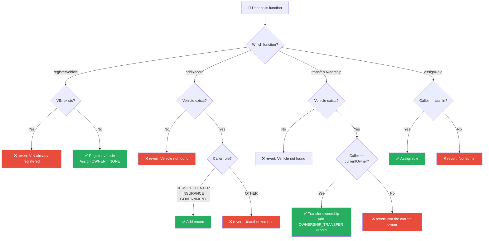
```mermaid
flowchart TD
    A["👤 User calls function"] --> B{"Which function?"}

    B -->|registerVehicle| C{"VIN exists?"}
    C -->|Yes| D["❌ revert: VIN already registered"]
    C -->|No| E["✅ Register vehicle\nAssign OWNER if NONE"]

    B -->|addRecord| F{"Vehicle exists?"}
    F -->|No| G["❌ revert: Vehicle not found"]
    F -->|Yes| H{"Caller role?"}
    H -->|"SERVICE_CENTER\nINSURANCE\nGOVERNMENT"| I["✅ Add record"]
    H -->|OTHER| J["❌ revert: Unauthorized role"]

    B -->|transferOwnership| K{"Vehicle exists?"}
    K -->|No| L["❌ revert: Vehicle not found"]
    K -->|Yes| M{"Caller ==\ncurrentOwner?"}
    M -->|Yes| N["✅ Transfer ownership\nAdd OWNERSHIP_TRANSFER record"]
    M -->|No| O["❌ revert: Not the current owner"]

    B -->|assignRole| P{"Caller == admin?"}
    P -->|Yes| Q["✅ Assign role"]
    P -->|No| R["❌ revert: Not admin"]

    style D fill:#e74c3c,color:#fff
    style G fill:#e74c3c,color:#fff
    style J fill:#e74c3c,color:#fff
    style O fill:#e74c3c,color:#fff
    style R fill:#e74c3c,color:#fff
    style E fill:#27ae60,color:#fff
    style I fill:#27ae60,color:#fff
    style N fill:#27ae60,color:#fff
    style Q fill:#27ae60,color:#fff
```

### Modifier System

```solidity
modifier onlyAdmin() {
    require(msg.sender == admin, "Not admin");
    _;
}

modifier onlyRole(Role _role) {
    require(roles[msg.sender] == _role, "Unauthorized role");
    _;
}
```

---

## 7. Backend Architecture

### Server Setup

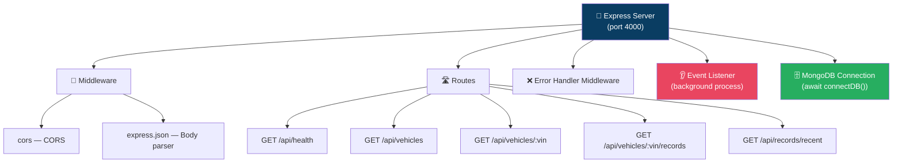
```mermaid
flowchart TD
    A["🚀 Express Server\n(port 4000)"] --> B["🔌 Middleware"]
    B --> C["cors — CORS"]
    B --> D["express.json — Body parser"]
    A --> E["🛣️ Routes"]
    E --> F["GET /api/health"]
    E --> G["GET /api/vehicles"]
    E --> H["GET /api/vehicles/:vin"]
    E --> I["GET /api/vehicles/:vin/records"]
    E --> J["GET /api/records/recent"]
    A --> K["❌ Error Handler Middleware"]
    A --> L["👂 Event Listener\n(background process)"]
    A --> M["🗄️ MongoDB Connection\n(await connectDB())"]

    style A fill:#0a3d62,color:#fff
    style L fill:#e94560,color:#fff
    style M fill:#27ae60,color:#fff
```

### Dual Data Source Strategy

The backend uses a **dual data source** approach:

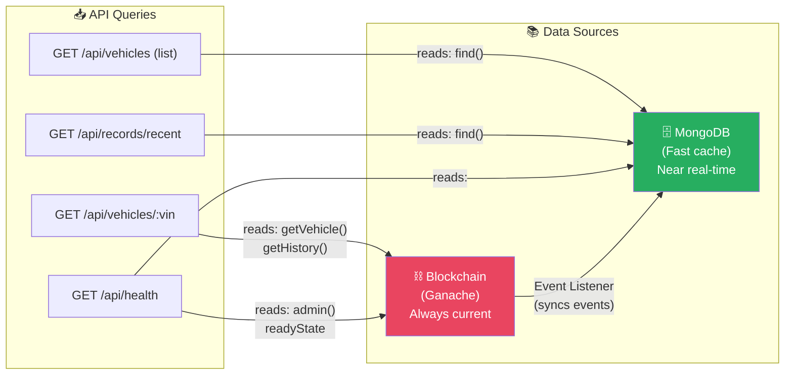
```mermaid
flowchart LR
    subgraph Queries["📥 API Queries"]
        Q1["GET /api/vehicles/:vin"]
        Q2["GET /api/vehicles (list)"]
        Q3["GET /api/records/recent"]
        Q4["GET /api/health"]
    end

    subgraph Sources["📚 Data Sources"]
        Blockchain["⛓️ Blockchain\n(Ganache)\nAlways current"]
        MongoDB["🗄️ MongoDB\n(Fast cache)\nNear real-time"]
    end

    Q1 -->|"reads: getVehicle()\ngetHistory()"| Blockchain
    Q2 -->|"reads: find()"| MongoDB
    Q3 -->|"reads: find()"| MongoDB
    Q4 -->|"reads: admin()\nreadyState"| Blockchain
    Q4 -->|"reads:"| MongoDB

    Blockchain -->|"Event Listener\n(syncs events)"| MongoDB

    style Blockchain fill:#e94560,color:#fff
    style MongoDB fill:#27ae60,color:#fff
```

| Data Source | Used For | Freshness |
|-------------|----------|-----------|
| **Blockchain (direct read)** | Vehicle detail + history | Always current |
| **MongoDB (cached)** | Vehicle list, search, recent records | Near real-time (event-driven) |

This design provides:
- **Fast queries** for search/list operations (MongoDB is faster than blockchain reads)
- **Always-fresh data** for critical operations (direct blockchain reads)
- **Redundancy** — if MongoDB is down, blockchain data is still accessible

### Backend Configuration

```javascript
// config/contract.js
const provider = new ethers.JsonRpcProvider(RPC_URL);
const contract = new ethers.Contract(CONTRACT_ADDRESS, abi, provider);
// provider = read-only connection to Ganache
// contract = Contract instance for querying blockchain data
```

---

## 8. Frontend Architecture

### Component Hierarchy

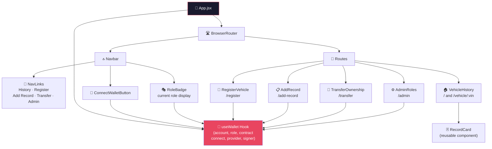
```mermaid
graph TB
    App["📱 App.jsx"] --> Router["🛣️ BrowserRouter"]
    Router --> Navbar["🔝 Navbar"]
    Router --> Routes["📄 Routes"]

    Navbar --> NavLinks["🔗 NavLinks\nHistory · Register\nAdd Record · Transfer · Admin"]
    Navbar --> RoleBadge["🎭 RoleBadge\ncurrent role display"]
    Navbar --> ConnectWallet["🔐 ConnectWalletButton"]

    Routes --> VH["🏠 VehicleHistory\n/ and /vehicle/:vin"]
    Routes --> RV["📝 RegisterVehicle\n/register"]
    Routes --> AR["📋 AddRecord\n/add-record"]
    Routes --> TO["🔄 TransferOwnership\n/transfer"]
    Routes --> Admin["⚙️ AdminRoles\n/admin"]

    VH --> RC["🃏 RecordCard\n(reusable component)"]

    App --> UseWallet["🎣 useWallet Hook\n(account, role, contract\nconnect, provider, signer)"]

    ConnectWallet --> UseWallet
    RoleBadge --> UseWallet
    RV --> UseWallet
    AR --> UseWallet
    TO --> UseWallet
    Admin --> UseWallet

    style App fill:#1a1a2e,stroke:#e94560,color:#fff
    style UseWallet fill:#e94560,color:#fff
```

### State Management

The application uses **React hooks** for state management:

```javascript
// useWallet.js — Central wallet state
{
    account: string | null,      // Connected wallet address
    role: number | null,         // Numeric role (0-5)
    roleName: string,            // "OWNER", "SERVICE_CENTER", etc.
    provider: BrowserProvider,   // ethers.js provider
    signer: JsonRpcSigner,       // ethers.js signer (MetaMask)
    contract: Contract,          // ethers.js contract (connected to signer)
    wrongNetwork: boolean,       // Is user on wrong chain?
    connect: () => Promise<void> // Connection function
}
```

### Wallet Connection Flow

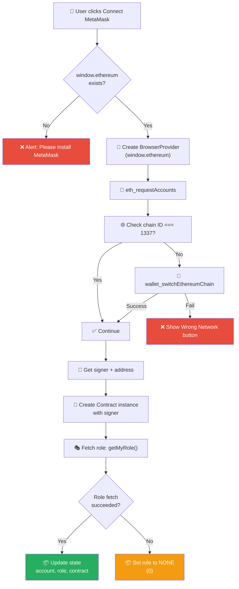
```mermaid
flowchart TD
    A["👤 User clicks Connect MetaMask"] --> B{"window.ethereum\nexists?"}

    B -->|No| C["❌ Alert: Please install MetaMask"]
    B -->|Yes| D["🔗 Create BrowserProvider\n(window.ethereum)"]
    D --> E["📡 eth_requestAccounts"]
    E --> F["🌐 Check chain ID === 1337?"]

    F -->|No| G["🔄 wallet_switchEthereumChain"]
    G -->|Success| H["✅ Continue"]
    G -->|Fail| I["❌ Show Wrong Network button"]

    F -->|Yes| H
    H --> J["🔑 Get signer + address"]
    J --> K["📜 Create Contract instance\nwith signer"]
    K --> L["🎭 Fetch role: getMyRole()"]
    L --> M{"Role fetch\nsucceeded?"}
    M -->|Yes| N["📦 Update state\naccount, role, contract"]
    M -->|No| O["📦 Set role to NONE\n(0)"]

    style C fill:#e74c3c,color:#fff
    style I fill:#e74c3c,color:#fff
    style N fill:#27ae60,color:#fff
    style O fill:#f39c12,color:#fff
```

### Proxy Configuration

```javascript
// vite.config.js
server: {
    proxy: {
        "/api": {
            target: "http://localhost:4000",
            changeOrigin: true,
        },
    },
},
```

Frontend API calls to `/api/*` are transparently proxied to the backend server. This avoids CORS issues during development.

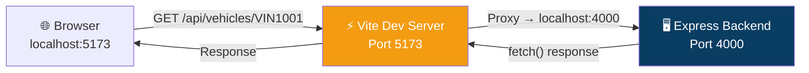
```mermaid
flowchart LR
    A["🌐 Browser\nlocalhost:5173"] -->|"GET /api/vehicles/VIN1001"| B["⚡ Vite Dev Server\nPort 5173"]
    B -->|"Proxy → localhost:4000"| C["🖥️ Express Backend\nPort 4000"]
    C -->|"fetch() response"| B
    B -->|"Response"| A

    style B fill:#f39c12,color:#fff
    style C fill:#0a3d62,color:#fff
```

---

## 9. Database Design

### MongoDB Collections

#### VehicleIndex Collection

```javascript
{
    vin: String,              // Vehicle Identification Number (unique)
    currentOwner: String,     // Owner's wallet address
    registeredAt: Date,       // Registration timestamp
    lastUpdatedAt: Date,      // Last modification timestamp
    recordCount: Number,      // Number of records (denormalized)
    status: String            // "active", "transferred", etc.
}
```

**Indexes:** `vin` (unique), `currentOwner`, `make`, `model`

#### RecordIndex Collection

```javascript
{
    vin: String,              // Parent vehicle VIN
    recordType: String,       // "SERVICE", "ACCIDENT", "INSURANCE", etc.
    dataHash: String,         // Optional document hash
    description: String,      // Human-readable description
    recordedBy: String,       // Recorder's wallet address
    timestamp: Date,          // When recorded
    txHash: String,           // Blockchain transaction hash
    blockNumber: Number       // Block number on chain
}
```

**Indexes:** `vin`, `recordType`, `timestamp`, `txHash`

### Entity Relationship Diagram

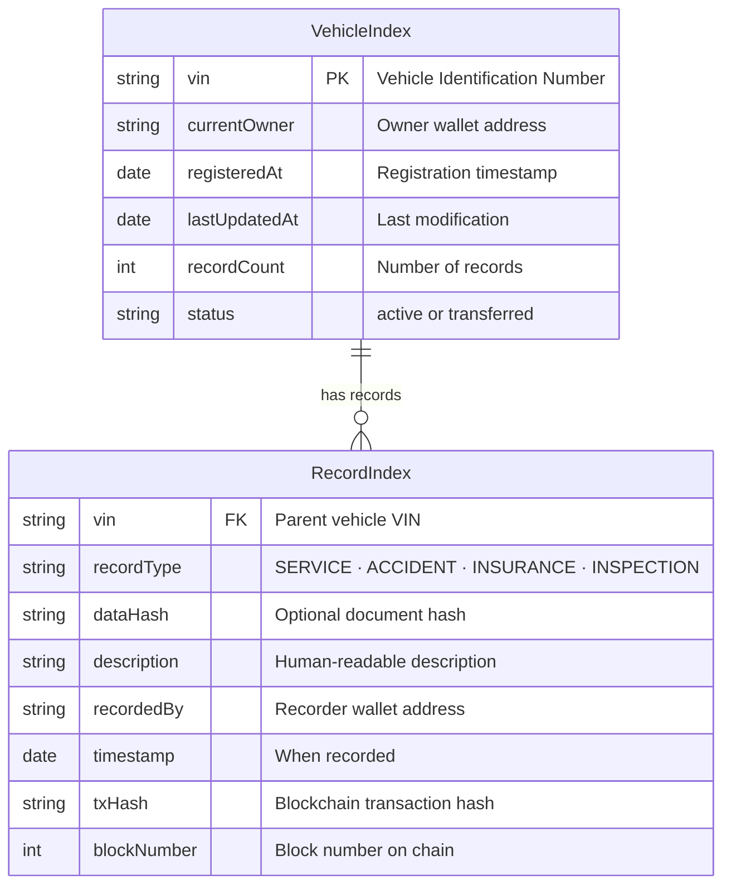
```mermaid
erDiagram
    VehicleIndex ||--o{ RecordIndex : "has records"
    VehicleIndex {
        string vin PK "Vehicle Identification Number"
        string currentOwner "Owner wallet address"
        date registeredAt "Registration timestamp"
        date lastUpdatedAt "Last modification"
        int recordCount "Number of records"
        string status "active or transferred"
    }
    RecordIndex {
        string vin FK "Parent vehicle VIN"
        string recordType "SERVICE · ACCIDENT · INSURANCE · INSPECTION"
        string dataHash "Optional document hash"
        string description "Human-readable description"
        string recordedBy "Recorder wallet address"
        date timestamp "When recorded"
        string txHash "Blockchain transaction hash"
        int blockNumber "Block number on chain"
    }
```

### Why MongoDB?

| Reason | Explanation |
|--------|-------------|
| Schema flexibility | Vehicle and record structures may evolve |
| Fast reads | Optimized for the query patterns (search, list, recent) |
| Atlas hosting | Managed cloud database, no local setup needed |
| Event sync | Easy to update with Mongoose `findOneAndUpdate` |

---

## 10. Data Flow Diagrams

### Flow 1: Vehicle Registration

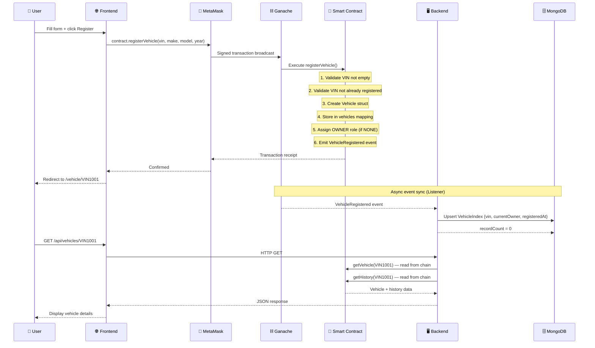
```mermaid
sequenceDiagram
    participant U as 👤 User
    participant F as 🌐 Frontend
    participant M as 🔐 MetaMask
    participant G as ⛓️ Ganache
    participant C as 📜 Smart Contract
    participant B as 🖥️ Backend
    participant DB as 🗄️ MongoDB

    U->>F: Fill form + click Register
    F->>M: contract.registerVehicle(vin, make, model, year)
    M->>G: Signed transaction broadcast
    G->>C: Execute registerVehicle()

    Note over C: 1. Validate VIN not empty
    Note over C: 2. Validate VIN not already registered
    Note over C: 3. Create Vehicle struct
    Note over C: 4. Store in vehicles mapping
    Note over C: 5. Assign OWNER role (if NONE)
    Note over C: 6. Emit VehicleRegistered event

    C-->>M: Transaction receipt
    M-->>F: Confirmed
    F-->>U: Redirect to /vehicle/VIN1001

    Note over G,DB: Async event sync (Listener)
    G-->>B: VehicleRegistered event
    B->>DB: Upsert VehicleIndex {vin, currentOwner, registeredAt}
    B-->>DB: recordCount = 0

    U->>F: GET /api/vehicles/VIN1001
    F->>B: HTTP GET
    B->>C: getVehicle(VIN1001) — read from chain
    B->>C: getHistory(VIN1001) — read from chain
    C-->>B: Vehicle + history data
    B-->>F: JSON response
    F-->>U: Display vehicle details
```

### Flow 2: Adding a Record

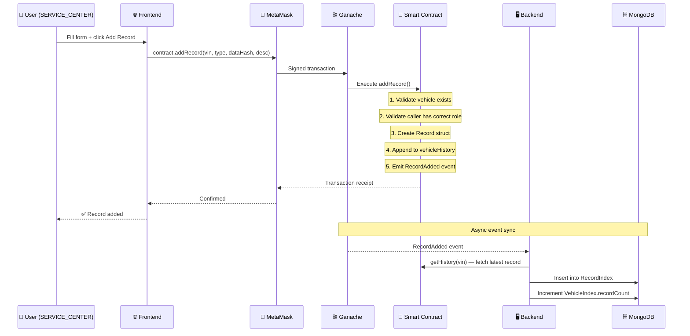
```mermaid
sequenceDiagram
    participant U as 👤 User (SERVICE_CENTER)
    participant F as 🌐 Frontend
    participant M as 🔐 MetaMask
    participant G as ⛓️ Ganache
    participant C as 📜 Smart Contract
    participant B as 🖥️ Backend
    participant DB as 🗄️ MongoDB

    U->>F: Fill form + click Add Record
    F->>M: contract.addRecord(vin, type, dataHash, desc)
    M->>G: Signed transaction
    G->>C: Execute addRecord()

    Note over C: 1. Validate vehicle exists
    Note over C: 2. Validate caller has correct role
    Note over C: 3. Create Record struct
    Note over C: 4. Append to vehicleHistory
    Note over C: 5. Emit RecordAdded event

    C-->>M: Transaction receipt
    M-->>F: Confirmed
    F-->>U: ✅ Record added

    Note over G,DB: Async event sync
    G-->>B: RecordAdded event
    B->>C: getHistory(vin) — fetch latest record
    B->>DB: Insert into RecordIndex
    B->>DB: Increment VehicleIndex.recordCount
```

### Flow 3: Ownership Transfer

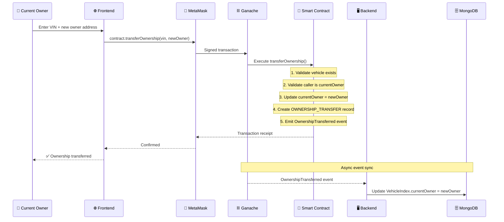
```mermaid
sequenceDiagram
    participant U as 👤 Current Owner
    participant F as 🌐 Frontend
    participant M as 🔐 MetaMask
    participant G as ⛓️ Ganache
    participant C as 📜 Smart Contract
    participant B as 🖥️ Backend
    participant DB as 🗄️ MongoDB

    U->>F: Enter VIN + new owner address
    F->>M: contract.transferOwnership(vin, newOwner)
    M->>G: Signed transaction
    G->>C: Execute transferOwnership()

    Note over C: 1. Validate vehicle exists
    Note over C: 2. Validate caller is currentOwner
    Note over C: 3. Update currentOwner = newOwner
    Note over C: 4. Create OWNERSHIP_TRANSFER record
    Note over C: 5. Emit OwnershipTransferred event

    C-->>M: Transaction receipt
    M-->>F: Confirmed
    F-->>U: ✅ Ownership transferred

    Note over G,DB: Async event sync
    G-->>B: OwnershipTransferred event
    B->>DB: Update VehicleIndex.currentOwner = newOwner
```

### Flow 4: Public History Lookup (No Wallet Required)

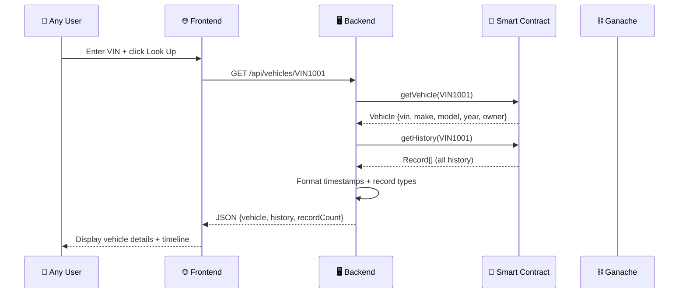
```mermaid
sequenceDiagram
    participant U as 👤 Any User
    participant F as 🌐 Frontend
    participant B as 🖥️ Backend
    participant C as 📜 Smart Contract
    participant G as ⛓️ Ganache

    U->>F: Enter VIN + click Look Up
    F->>B: GET /api/vehicles/VIN1001
    B->>C: getVehicle(VIN1001)
    C-->>B: Vehicle {vin, make, model, year, owner}
    B->>C: getHistory(VIN1001)
    C-->>B: Record[] (all history)
    B->>B: Format timestamps + record types
    B-->>F: JSON {vehicle, history, recordCount}
    F-->>U: Display vehicle details + timeline
```

### Flow 5: Event-Driven MongoDB Sync

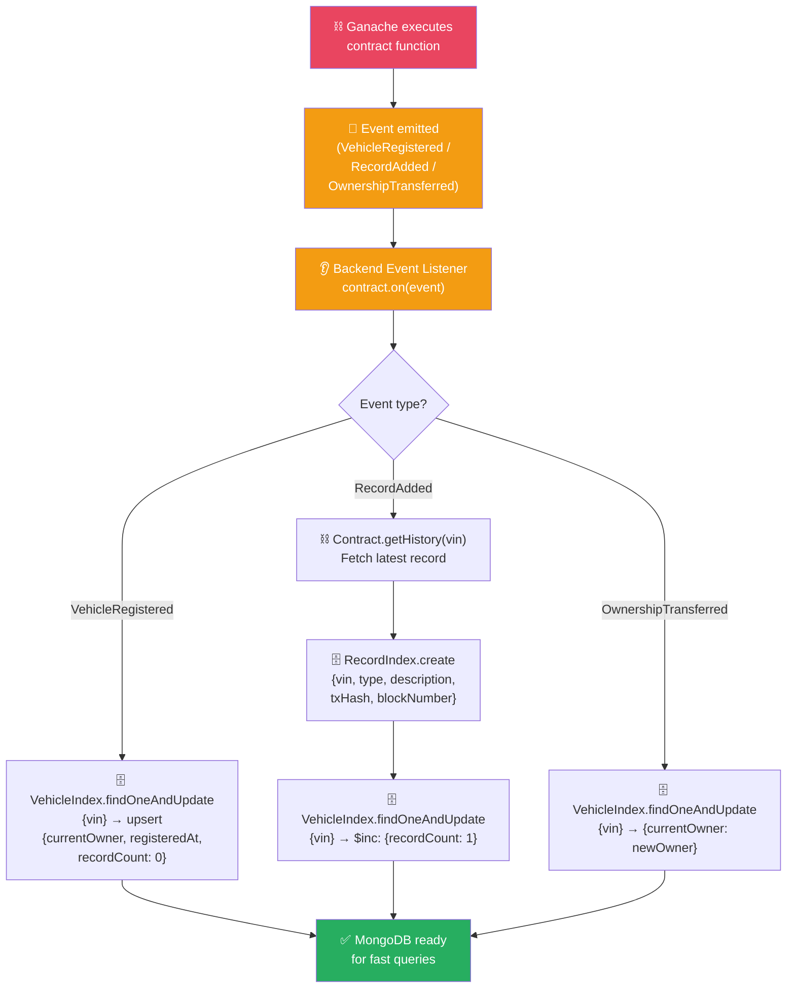
```mermaid
flowchart TD
    A["⛓️ Ganache executes\ncontract function"] --> B["📡 Event emitted\n(VehicleRegistered /\nRecordAdded /\nOwnershipTransferred)"]

    B --> C["👂 Backend Event Listener\ncontract.on(event)"]

    C --> D{"Event type?"}

    D -->|"VehicleRegistered"| E["🗄️ VehicleIndex.findOneAndUpdate\n{vin} → upsert\n{currentOwner, registeredAt,\nrecordCount: 0}"]

    D -->|"RecordAdded"| F["⛓️ Contract.getHistory(vin)\nFetch latest record"]
    F --> G["🗄️ RecordIndex.create\n{vin, type, description,\ntxHash, blockNumber}"]
    G --> H["🗄️ VehicleIndex.findOneAndUpdate\n{vin} → $inc: {recordCount: 1}"]

    D -->|"OwnershipTransferred"| I["🗄️ VehicleIndex.findOneAndUpdate\n{vin} → {currentOwner: newOwner}"]

    E --> J["✅ MongoDB ready\nfor fast queries"]
    H --> J
    I --> J

    style A fill:#e94560,color:#fff
    style B fill:#f39c12,color:#fff
    style C fill:#f39c12,color:#fff
    style J fill:#27ae60,color:#fff
```

---

## 11. Feature Specification

### Feature 1: Vehicle Registration

| Aspect | Detail |
|--------|--------|
| **Description** | Register a new vehicle on the blockchain with VIN, make, model, year |
| **Actor** | Any MetaMask-connected user |
| **Input** | VIN (string), Make (string), Model (string), Year (uint16) |
| **Output** | Vehicle registered on-chain, event emitted, MongoDB synced |
| **Constraints** | VIN must be unique and non-empty |
| **Gas Cost** | ~0.0001 ETH on Ganache |

### Feature 2: Role-Based Access Control

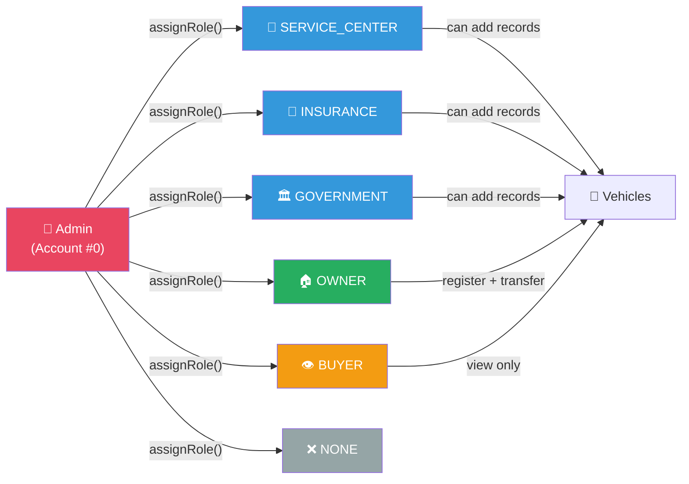
```mermaid
flowchart LR
    Admin["👤 Admin\n(Account #0)"] -->|"assignRole()"| SC["🔧 SERVICE_CENTER"]
    Admin -->|"assignRole()"| INS["🏥 INSURANCE"]
    Admin -->|"assignRole()"| GOV["🏛️ GOVERNMENT"]
    Admin -->|"assignRole()"| OWN["🏠 OWNER"]
    Admin -->|"assignRole()"| BUY["👁️ BUYER"]
    Admin -->|"assignRole()"| NONE["❌ NONE"]

    SC -->|"can add records"| Vehicles["🚗 Vehicles"]
    INS -->|"can add records"| Vehicles
    GOV -->|"can add records"| Vehicles
    OWN -->|"register + transfer"| Vehicles
    BUY -->|"view only"| Vehicles

    style Admin fill:#e94560,color:#fff
    style SC fill:#3498db,color:#fff
    style INS fill:#3498db,color:#fff
    style GOV fill:#3498db,color:#fff
    style OWN fill:#27ae60,color:#fff
    style BUY fill:#f39c12,color:#fff
    style NONE fill:#95a5a6,color:#fff
```

| Aspect | Detail |
|--------|--------|
| **Description** | Admin assigns roles to accounts, determining their permissions |
| **Actor** | Contract admin (deployer) only |
| **Roles** | NONE, OWNER, SERVICE_CENTER, INSURANCE, GOVERNMENT, BUYER |
| **On-chain** | `roles` mapping updated, `RoleAssigned` event emitted |
| **Off-chain** | Frontend reads role via `getMyRole()` and shows/hides UI elements |

### Feature 3: Record Management

| Aspect | Detail |
|--------|--------|
| **Description** | Authorized roles add immutable records to vehicle history |
| **Record Types** | SERVICE, ACCIDENT, INSURANCE, INSPECTION |
| **Authorized Roles** | SERVICE_CENTER, INSURANCE, GOVERNMENT |
| **Immutability** | Records cannot be modified or deleted once written |
| **Audit Trail** | Each record stores who recorded it and when |

### Feature 4: Ownership Transfer

| Aspect | Detail |
|--------|--------|
| **Description** | Transfer vehicle ownership to another wallet address |
| **Actor** | Current vehicle owner only |
| **Validation** | Contract verifies caller is the current owner |
| **Side Effects** | Automatically creates OWNERSHIP_TRANSFER record in history |
| **Event** | OwnershipTransferred emitted for backend sync |

### Feature 5: Public Vehicle History Lookup

| Aspect | Detail |
|--------|--------|
| **Description** | Anyone can view a vehicle's complete history by VIN |
| **No Wallet Required** | Works without MetaMask connection |
| **Data Source** | Reads directly from blockchain (source of truth) |
| **Includes** | Registration, all records, ownership transfers |

### Feature 6: Real-Time Event Sync

| Aspect | Detail |
|--------|--------|
| **Description** | Backend listens to blockchain events and syncs to MongoDB |
| **Events Tracked** | VehicleRegistered, RecordAdded, OwnershipTransferred |
| **Latency** | Near real-time (< 1 second) |
| **Purpose** | Enables fast search/list queries without blockchain reads |

---

## 12. Security Model

### Threat Model

| Threat | Mitigation |
|--------|-----------|
| **Unauthorized record writing** | Role-based access control on-chain |
| **Unauthorized ownership transfer** | Contract verifies `msg.sender == currentOwner` |
| **Unauthorized role assignment** | Only admin can call `assignRole` |
| **Data tampering** | Blockchain immutability — records can't be modified |
| **Private key compromise** | MetaMask manages keys; private keys never leave the browser |
| **Replay attacks** | Each transaction has a unique nonce |
| **Frontend manipulation** | All writes go through MetaMask signing; backend only reads |

### Trust Boundaries

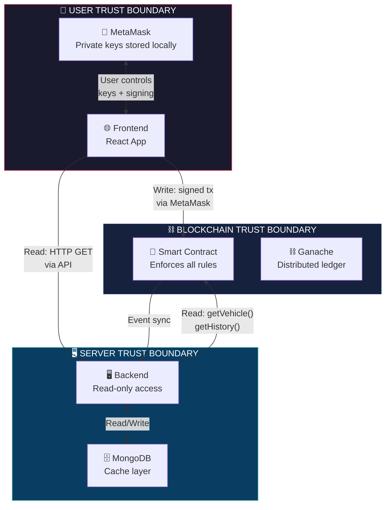
```mermaid
flowchart TB
    subgraph UserSide["👤 USER TRUST BOUNDARY"]
        MetaMask["🔐 MetaMask\nPrivate keys stored locally"]
        Frontend["🌐 Frontend\nReact App"]
    end

    subgraph Chain["⛓️ BLOCKCHAIN TRUST BOUNDARY"]
        Contract["📜 Smart Contract\nEnforces all rules"]
        Ganache["⛓️ Ganache\nDistributed ledger"]
    end

    subgraph ServerSide["🖥️ SERVER TRUST BOUNDARY"]
        Backend["🖥️ Backend\nRead-only access"]
        MongoDB["🗄️ MongoDB\nCache layer"]
    end

    MetaMask <-->|"User controls\nkeys + signing"| Frontend
    Frontend -->|"Write: signed tx\nvia MetaMask"| Contract
    Frontend -->|"Read: HTTP GET\nvia API"| Backend
    Contract -->|"Event sync"| Backend
    Backend <-->|"Read/Write"| MongoDB
    Backend -->|"Read: getVehicle()\ngetHistory()"| Contract

    style UserSide fill:#1a1a2e,stroke:#e94560,color:#fff
    style Chain fill:#16213e,stroke:#0f3460,color:#fff
    style ServerSide fill:#0a3d62,stroke:#38ada9,color:#fff
```

### Key Security Properties

1. **No single point of failure:** Data exists on both blockchain and MongoDB
2. **Write authorization:** Every write requires cryptographic signature via MetaMask
3. **Read authorization:** All reads are public (by design for transparency)
4. **Immutability:** Historical records cannot be altered
5. **Auditability:** Every action is traceable to a wallet address and timestamp

---

## 13. API Reference

### Health Check

```
GET /api/health
```

**Response:**
```json
{
    "status": "ok",
    "chainConnected": true,
    "dbConnected": true
}
```

### Get Vehicle Detail

```
GET /api/vehicles/:vin
```

**Response:**
```json
{
    "vin": "VIN1001",
    "make": "Toyota",
    "model": "Camry",
    "year": 2023,
    "currentOwner": "0x90F8bf6A479f320ead074411a4B0e7944Ea8c9C1",
    "exists": true,
    "history": [
        {
            "index": 0,
            "recordType": "SERVICE",
            "dataHash": "",
            "description": "Regular oil change",
            "recordedBy": "0xFFcf8FDEE72ac11b5c542428B35EEF5769C409f0",
            "timestamp": "2024-01-15T10:30:00.000Z"
        }
    ],
    "recordCount": 1
}
```

### List Vehicles

```
GET /api/vehicles?make=Toyota&model=Camry&owner=0x...
```

**Query Parameters:** `make`, `model`, `owner`, `status` (all optional)

### Get Vehicle Records

```
GET /api/vehicles/:vin/records
```

### Get Recent Records

```
GET /api/records/recent?limit=20
```

### API Route Flow

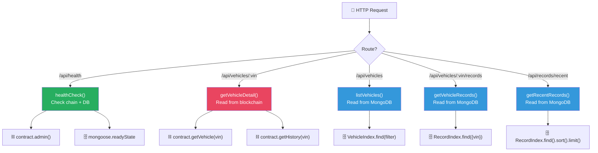
```mermaid
flowchart TD
    A["📡 HTTP Request"] --> B{"Route?"}
    B -->|"/api/health"| C["healthCheck()\nCheck chain + DB"]
    B -->|"/api/vehicles/:vin"| D["getVehicleDetail()\nRead from blockchain"]
    B -->|"/api/vehicles"| E["listVehicles()\nRead from MongoDB"]
    B -->|"/api/vehicles/:vin/records"| F["getVehicleRecords()\nRead from MongoDB"]
    B -->|"/api/records/recent"| G["getRecentRecords()\nRead from MongoDB"]

    C --> H["⛓️ contract.admin()"]
    C --> I["🗄️ mongoose.readyState"]
    D --> J["⛓️ contract.getVehicle(vin)"]
    D --> K["⛓️ contract.getHistory(vin)"]
    E --> L["🗄️ VehicleIndex.find(filter)"]
    F --> M["🗄️ RecordIndex.find({vin})"]
    G --> N["🗄️ RecordIndex.find().sort().limit()"]

    style C fill:#27ae60,color:#fff
    style D fill:#e94560,color:#fff
    style E fill:#3498db,color:#fff
    style F fill:#3498db,color:#fff
    style G fill:#3498db,color:#fff
```

---

## 14. Event-Driven Architecture

### Why Events?

Blockchain events are a **publish-subscribe mechanism** built into Ethereum. When a smart contract function executes, it can emit events that are:

1. **Stored on-chain** as part of the transaction receipt
2. **Accessible off-chain** without querying contract state
3. **Efficient to filter** by topic (indexed parameters)

### Event Flow

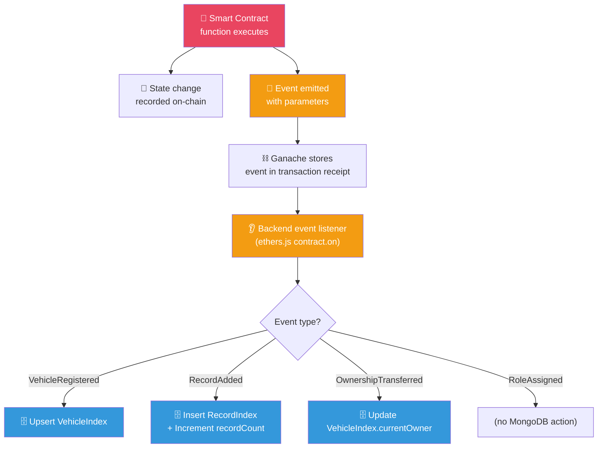
```mermaid
flowchart TD
    A["📜 Smart Contract\nfunction executes"] --> B["💾 State change\nrecorded on-chain"]
    A --> C["📡 Event emitted\nwith parameters"]

    C --> D["⛓️ Ganache stores\nevent in transaction receipt"]
    D --> E["👂 Backend event listener\n(ethers.js contract.on)"]

    E --> F{"Event type?"}
    F -->|"VehicleRegistered"| G["🗄️ Upsert VehicleIndex"]
    F -->|"RecordAdded"| H["🗄️ Insert RecordIndex\n+ Increment recordCount"]
    F -->|"OwnershipTransferred"| I["🗄️ Update VehicleIndex.currentOwner"]
    F -->|"RoleAssigned"| J["(no MongoDB action)"]

    style A fill:#e94560,color:#fff
    style C fill:#f39c12,color:#fff
    style E fill:#f39c12,color:#fff
    style G fill:#3498db,color:#fff
    style H fill:#3498db,color:#fff
    style I fill:#3498db,color:#fff
```

### Events in This System

| Event | Emitted By | Parameters | MongoDB Action |
|-------|-----------|------------|----------------|
| `VehicleRegistered` | `registerVehicle()` | vin, owner, timestamp | Upsert VehicleIndex |
| `RecordAdded` | `addRecord()` | vin, recordType, recordedBy, timestamp | Insert RecordIndex, increment recordCount |
| `OwnershipTransferred` | `transferOwnership()` | vin, from, to, timestamp | Update VehicleIndex.currentOwner |
| `RoleAssigned` | `assignRole()` | user, role | (no MongoDB action) |

---

## 15. Deployment Architecture

### Development Setup

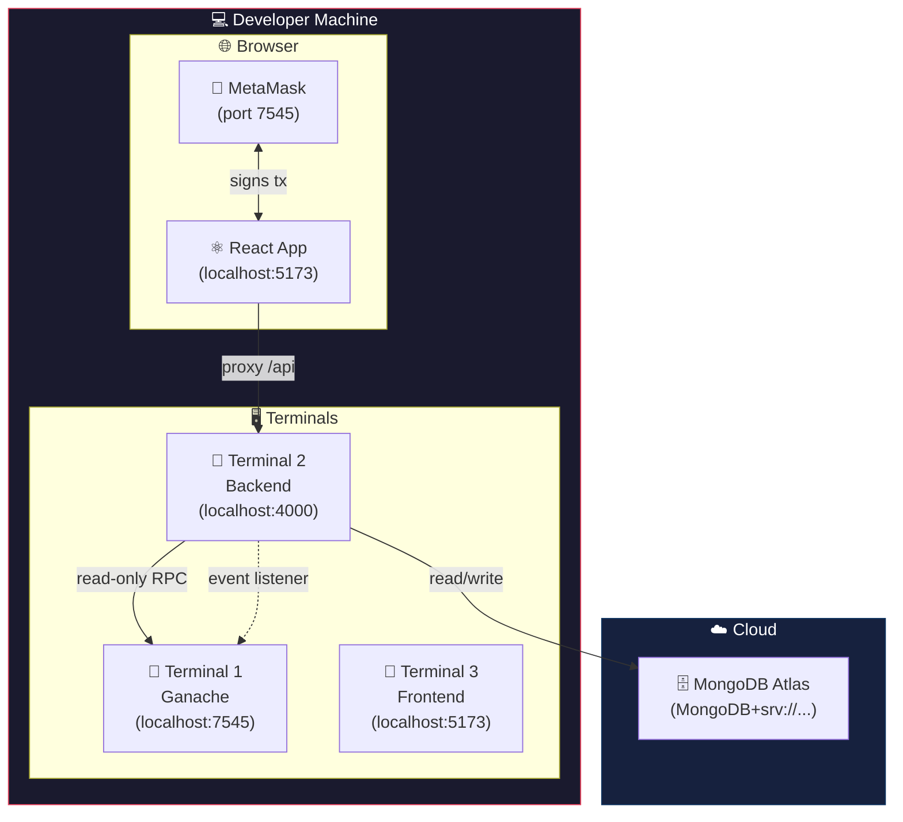
```mermaid
flowchart TB
    subgraph Machine["💻 Developer Machine"]
        subgraph Browser["🌐 Browser"]
            MM["🔐 MetaMask\n(port 7545)"]
            React["⚛️ React App\n(localhost:5173)"]
        end

        subgraph Terminals["🖥️ Terminals"]
            T1["📡 Terminal 1\nGanache\n(localhost:7545)"]
            T2["📡 Terminal 2\nBackend\n(localhost:4000)"]
            T3["📡 Terminal 3\nFrontend\n(localhost:5173)"]
        end
    end

    subgraph Cloud["☁️ Cloud"]
        MongoDB["🗄️ MongoDB Atlas\n(MongoDB+srv://...)"]
    end

    MM <-->|"signs tx"| React
    React -->|"proxy /api"| T2
    T2 -->|"read-only RPC"| T1
    T2 -->|"read/write"| MongoDB
    T2 -.->|"event listener"| T1

    style Machine fill:#1a1a2e,stroke:#e94560,color:#fff
    style Cloud fill:#16213e,stroke:#0f3460,color:#fff
```

### Network Topology

```mermaid
flowchart LR
    subgraph FrontendPort["Frontend :5173"]
        Vite["⚡ Vite Dev Server"]
        Proxy["🔀 /api proxy"]
    end

    subgraph BackendPort["Backend :4000"]
        Express["🚀 Express"]
        EventL["👂 Event Listener"]
    end

    subgraph ChainPort["Ganache :7545"]
        Chain["⛓️ Blockchain"]
        RPC["📡 JSON-RPC"]
    end

    subgraph CloudDB["MongoDB Atlas"]
        DB["🗄️ vehicle_registry"]
    end

    Vite -->|"fetch /api/*"| Proxy
    Proxy -->|"forward"| Express
    Express -->|"eth_getVehicle"| RPC
    RPC --> Chain
    Chain -->|"events"| EventL
    EventL -->|"findOneAndUpdate"| DB
    Express -->|"query"| DB

    style FrontendPort fill:#3498db,color:#fff
    style BackendPort fill:#0a3d62,color:#fff
    style ChainPort fill:#e94560,color:#fff
    style CloudDB fill:#27ae60,color:#fff
```

### Production Considerations

| Component | Development | Production |
|-----------|------------|-----------|
| Blockchain | Ganache (local) | Ethereum mainnet / Polygon / other L2 |
| Database | MongoDB Atlas | MongoDB Atlas (with proper auth) |
| Backend | localhost:4000 | Cloud hosting (AWS, Heroku, etc.) |
| Frontend | Vite dev server | Static build + CDN |
| Wallet | MetaMask (dev network) | MetaMask + production network |

---

## 16. Non-Functional Requirements

### Performance

| Metric | Target | Current |
|--------|--------|---------|
| Vehicle registration confirmation | < 30 seconds | Depends on Ganache block time |
| History lookup response time | < 2 seconds | ~100ms (direct chain read) |
| MongoDB query response time | < 100ms | ~50ms |
| Frontend initial load | < 3 seconds | ~1.5 seconds (Vite) |

### Reliability

| Aspect | Strategy |
|--------|----------|
| Data durability | Blockchain provides immutable storage |
| Cache consistency | Event-driven sync keeps MongoDB current |
| Fault tolerance | If MongoDB is down, blockchain reads still work |
| Graceful degradation | Frontend shows error messages for failed operations |

### Scalability Considerations

| Challenge | Solution |
|-----------|----------|
| High transaction volume | Layer 2 solutions (Polygon, Optimism) |
| Fast search at scale | MongoDB indexing + pagination |
| Multiple vehicles | Already supports unlimited VINs |
| Concurrent users | MetaMask handles per-user signing |

---

## 17. Future Enhancements

| Enhancement | Description | Priority |
|-------------|-------------|----------|
| IPFS document storage | Store service invoices, accident photos on IPFS with on-chain hashes | High |
| NFT ownership certificates | Mint NFTs as proof of vehicle ownership | Medium |
| AI/ML fraud detection | Analyze record patterns for suspicious activity | Medium |
| Mobile app | QR code scanning for instant vehicle lookup | High |
| GPS/IoT integration | Real-time vehicle tracking data on-chain | Low |
| Cross-chain interoperability | Support multiple blockchains | Low |
| Government portal integration | Official API for registration authorities | Medium |
| Automated insurance | Smart contract-based premium calculation | Low |

```mermaid
timeline
    title Future Enhancement Roadmap
    section Phase 1 (High Priority)
        IPFS Document Storage : Store invoices & photos on IPFS
        Mobile App : QR code scanning
    section Phase 2 (Medium Priority)
        NFT Ownership Certificates : Mint NFTs as proof
        AI/ML Fraud Detection : Suspicious pattern analysis
        Government Portal : Official API integration
    section Phase 3 (Low Priority)
        GPS/IoT Integration : Real-time tracking
        Cross-chain : Multi-blockchain support
        Automated Insurance : Smart contract premiums
```

---

## Appendix: Contract ABI Summary

| Function | Type | Parameters | Returns |
|----------|------|-----------|---------|
| `registerVehicle` | Transaction | vin, make, model, year | — |
| `addRecord` | Transaction | vin, recordType, dataHash, description | — |
| `transferOwnership` | Transaction | vin, newOwner | — |
| `assignRole` | Transaction | user, role | — |
| `getVehicle` | View | vin | Vehicle struct |
| `getHistory` | View | vin | Record[] |
| `getMyRole` | View | — | Role enum |
| `admin` | View | — | address |
| `roles` | View | address | Role enum |

| Event | Parameters |
|-------|-----------|
| `VehicleRegistered` | vin, owner (indexed), timestamp |
| `RecordAdded` | vin, recordType, recordedBy (indexed), timestamp |
| `OwnershipTransferred` | vin, from (indexed), to (indexed), timestamp |
| `RoleAssigned` | user (indexed), role |
